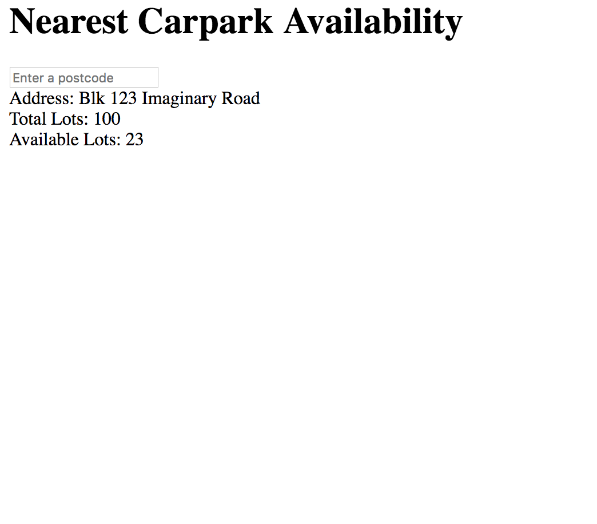

# Build your own web app

---

# Why?

* NOT to become a software engineer
* Show you basics of how web apps work
* Have more meaningful discussion about web applications (understand the lingo)
* Give you confidence to learn more/explore about code!
* Give you something real to take home!

---

# What you're going to build


---

# Outline

TODO: flesh this out

1. Basic setup and displaying text
1. 

---

# Setup

TODO: with setup this becomes not necessary

Download and install:

* Atom (https://atom.io/)
* Download Google-Drive folder (tinyurl.com/my-parking-app)

---

# Setup

Open the folder using Atom.

Open the HTML file using Google Chrome.


---

# Let's get coding!

## Displaying some text



---

```html
<body>
  hello
</body>
```

^ html, body, opening and closing tags

---


```html
<body>
  hello there!
</body>
```

---


```html
<body>
  hello

  there!
</body>
```

^ html does not care about your file. just a structure

---


```html, [.highlight: 2]
<body>
  <h1>hello</h1>

  there!
</body>
```

^ different tags, a bit of styles

---


```html
<body>
  <h1>Nearest Carpark Availability</h1>
</body>
```

---

```html, [.highlight: 3]
<body>
  <h1>Nearest Carpark Availability</h1>
  <input>
</body>
```

---

```html, [.highlight: 3]
<body>
  <h1>Nearest Carpark Availability</h1>
  <input placeholder="Enter a postcode">
</body>
```

---

```html, [.highlight: 5]
<body>
  <h1>Nearest Carpark Availability</h1>
  <input placeholder="Enter a postcode">

  <div>Hello!</div>
</body>
```

---

```html
<body>
  <h1>Nearest Carpark Availability</h1>
  <input placeholder="Enter a postcode">

  <div>Address: Blk 123 Imaginary Road</div>
  <div>Total Lots: 100</div>
  <div>Available Lots: 23</div>
</body>
```

---

# A short detour

Adding styles to your page!

```html
<body style="lightskyblue">
  .
  .
  .
</body>
```

https://developer.mozilla.org/en-US/docs/Web/CSS/color_value

---

# A quick recap

* HTML files in browser are webpages
* HTML tells the browser what to display 
* HTML tags, attributes

---

# What's next

* Javascript - adding interactivity + logic

---

```html, [.highlight: 10]
<body>
  <h1>Nearest Carpark Availability</h1>
  <input placeholder="Enter a postcode">

  <div>Address: Blk 123 Imaginary Road</div>
  <div>Total Lots: 100</div>
  <div>Available Lots: 23</div>
</body>

<script> alert("Hello!") </script>
```

---

```html, [.highlight: 10]
<body>
  <h1>Nearest Carpark Availability</h1>
  <input placeholder="Enter a postcode">

  <div>Address: Blk 123 Imaginary Road</div>
  <div>Total Lots: 100</div>
  <div>Available Lots: 23</div>
</body>

<script src="carpark-logic.js"></script>
```

---

`carpark-logic.js`

```javascript
alert("Hello!")
```

---

We want to inject text into our HTML document.

1. Find the place where we want to inject text
1. Inject the text!

---

To find the right place to inject the text, we need to give the place a name!

---

`index.html`

```html, [.highlight: 5]
<body>
  <h1>Nearest Carpark Availability</h1>
  <input placeholder="Enter a postcode">

  <div id="carparkAddress">Address: Blk 123 Imaginary Road</div>
  <div>Total Lots: 100</div>
  <div>Available Lots: 23</div>
</body>

<script src="carpark-logic.js"></script>
```

---

`carpark-logic.js`

```javascript
document.getElementById("carparkAddress").innerText = "Address: Blk 456"
```

---

`index.html`

```html, [.highlight: 5-7]
<body>
  <h1>Nearest Carpark Availability</h1>
  <input placeholder="Enter a postcode">

  <div id="carparkAddress"></div>
  <div id="carparkTotalLots"></div>
  <div id="carparkAvailableLots"></div>
</body>

<script src="carpark-logic.js"></script>
```

---

`carpark-logic.js`

```javascript
document.getElementById("carparkAddress").innerText = "Address: Blk 456"
document.getElementById("carparkTotalLots").innerText = "Total Lots: 100"
document.getElementById("carparkAvailableLots").innerText = "Available Lots: 23"
```

---

`carpark-logic.js`

```javascript
function addCarparkToPage(address, totalLots, availableLots) {
  document.getElementById("carparkAddress").innerText = "Address: " + address
  document.getElementById("carparkTotalLots").innerText = "Total Lots: " + totalLots
  document.getElementById("carparkAvailableLots").innerText = "Available Lots: " + availableLots
}
```

---

`carpark-logic.js`

```javascript
function addCarparkToPage(address, totalLots, availableLots) {
  document.getElementById("carparkAddress").innerText = "Address: " + address
  document.getElementById("carparkTotalLots").innerText = "Total Lots: " + totalLots
  document.getElementById("carparkAvailableLots").innerText = "Available Lots: " + availableLots
}

addCarparkToPage("Blk 123 Imaginary Lane", 123, 12)
```

---

# Recap

* Javascript adds interactivity
* Javascript links to HTML using `getElementById`
* A function is a snippet of code that is grouped together
* Calling a function runs the code in it

---

# What's next?

* Handle the input typed in

---

`index.html`

```html, [.highlight: 3]
<body>
  <h1>Nearest Carpark Availability</h1>
  <input id="postcodeInput" placeholder="Enter a postcode">

  <div id="carparkAddress"></div>
  <div id="carparkTotalLots"></div>
  <div id="carparkAvailableLots"></div>
</body>

<script src="carpark-logic.js"></script>
```

---

`carpark-logic.js`

```javascript, [.highlight: 9]
function addCarparkToPage(address, totalLots, availableLots) {
  .
  .
  .
}

addCarparkToPage("Blk 123 Imaginary Lane", 123, 12)

document.getElementById("postcodeInput")
```

---

`carpark-logic.js`

```javascript, [.highlight: 9]
function addCarparkToPage(address, totalLots, availableLots) {
  .
  .
  .
}

addCarparkToPage("Blk 123 Imaginary Lane", 123, 12)

var postcodeInput = document.getElementById("postcodeInput")
```

---

`carpark-logic.js`

```javascript, [.highlight: 3]
var postcodeInput = document.getElementById("postcodeInput")

postcodeInput.addEventListener("keydown", handleKeydown)
```

---

`carpark-logic.js`

```javascript, [.highlight: 1-7]
var postcodeInput = document.getElementById("postcodeInput")

function handleKeydown(event) {
  addCarparkToPage("Blk 123 Imaginary Lane", 123, 12)
}

postcodeInput.addEventListener("keydown", handleKeydown)
```

\-\-\-

Remember to remove `addCarparkToPage` from earlier.

---

`carpark-logic.js`

```javascript, [.highlight: 2-4]
function handleKeydown(event) {
  if (event.key === "Enter") {
    addCarparkToPage("My Home", 123, 12)
  }
}
```

---

Now we need to get the postcode that we typed in.

We can do that in a similar way to how we injected the text.

---

`carpark-logic.js`

```javascript, [.highlight: 3]
function handleKeydown(event) {
  if (event.key === "Enter") {
    addCarparkToPage(postcodeInput.value, 123, 12)
  }
}
```

---

# Recap

* React to user input by registering **event listeners**

---

# What's next?

Now we need to use the postcode to find the nearest carpark.

We'll do that in two steps:

1) Postcode -> Latitude + Longitude

2) Latitude + Longitude -> Carpark

---

`carpark-logic.js`

```javascript, [.highlight: 1-3, 7]
function searchPostcode(postcode) {
  addCarparkToPage(postcode, 123, 12)
}

function handleKeydown(event) {
  if (event.key === "Enter") {
    searchPostcode(postcodeInput.value)
  }
}
```

---

We need to take the postcode and find the nearest carpark to it.

First, we will convert the postcode to X and Y values (similar to latitude and longitude).

To do that, we need to make an API call.

---

# What is an API call?

* Way for apps to communicate (over the internet)
* i.e. a phone call between apps

---

# Our API call

* Send over the postcode
* Receive X and Y values in the response

https://docs.onemap.sg/#onemap-rest-apis 

---

`index.html`

```html, [.highlight: 1-3]
<head>
  <script src="https://unpkg.com/axios/dist/axios.min.js"></script>
</head>

<body>
  <h1>Nearest Carpark Availability</h1>
  <input id="postcodeInput" placeholder="Enter a postcode">

  <div id="carparkAddress"></div>
  <div id="carparkTotalLots"></div>
  <div id="carparkAvailableLots"></div>
</body>

<script src="carpark-logic.js"></script>
```

---

`carpark-logic.js`

```javascript
function searchXY(response) {
  addCarparkToPage("My Home", 123, 12)
}

function searchPostcode(postcode) {
  axios.get("https://developers.onemap.sg/commonapi/search", {
    params: {
      searchVal: postcode,
      returnGeom: "Y",
      getAddrDetails: "N"
    }
  }).then(searchXY)
}
```

---

`carpark-logic.js`

```javascript, [.highlight: 2]
function searchXY(response) {
  var searchResult = response.data.results[0]
  addCarparkToPage("My Home", 123, 12)
}
```

---

`carpark-logic.js`

```javascript, [.highlight: 3]
function searchXY(response) {
  var searchResult = response.data.results[0]
  addCarparkToPage("My Home", searchResult.X, searchResult.Y)
}
```

---

Now we want to get the nearest carpark to that X and Y value.

---

`index.html`

```html, [.highlight: 14]
<head>
  <script src="https://unpkg.com/axios/dist/axios.min.js"></script>
</head>

<body>
  <h1>Nearest Carpark Availability</h1>
  <input id="postcodeInput" placeholder="Enter a postcode">

  <div id="carparkAddress"></div>
  <div id="carparkTotalLots"></div>
  <div id="carparkAvailableLots"></div>
</body>

<script src="carpark-helpers.js"></script>
<script src="carpark-logic.js"></script>
```

---

`carpark-logic.js`

```javascript, [.highlight: 9]
function addCarparkToPage([address, totalLots, availableLots]) {
  .
  .
  .
}

function searchXY(response) {
  var searchResult = response.data.results[0]
  getNearestCarparkTo(searchResult.X, searchResult.Y).then(addCarparkToPage)
}

```

---

# Recap

* Made API call to convert postcode to X and Y
* Use helper function to get the nearest carpark

---

# What's next?

* Content and logic is all done!
* Next - styling your site!

---

`index.html`

```html, [.highlight: 3]
<head>
  <script src="https://unpkg.com/axios/dist/axios.min.js"></script>
  <link rel="stylesheet" type="text/css" href="carpark-style.css"></link>
</head>

<body>
  <h1>Nearest Carpark Availability</h1>
  <input id="postcodeInput" placeholder="Enter a postcode">

  <div id="carparkAddress"></div>
  <div id="carparkTotalLots"></div>
  <div id="carparkAvailableLots"></div>
</body>

<script src="carpark-helpers.js"></script>
<script src="carpark-logic.js"></script>
```

---

`index.html`

```html, [.highlight: 7-10]
<head>
  <script src="https://unpkg.com/axios/dist/axios.min.js"></script>
  <link rel="stylesheet" type="text/css" href="carpark-style.css"></link>
</head>

<body>
  <div id="inputBackground">
    <h1>Nearest Carpark Availability</h1>
    <input id="postcodeInput" placeholder="Enter a postcode">
  </div>

  <div id="carparkAddress"></div>
  <div id="carparkTotalLots"></div>
  <div id="carparkAvailableLots"></div>
</body>

<script src="carpark-helpers.js"></script>
<script src="carpark-logic.js"></script>
```

---

`index.html`

```html, [.highlight: 12-16]
<head>
  <script src="https://unpkg.com/axios/dist/axios.min.js"></script>
  <link rel="stylesheet" type="text/css" href="carpark-style.css"></link>
</head>

<body>
  <div id="inputBackground">
    <h1>Nearest Carpark Availability</h1>
    <input id="postcodeInput" placeholder="Enter a postcode">
  </div>

  <div id="nearestCarpark">
    <div id="carparkAddress"></div>
    <div id="carparkTotalLots"></div>
    <div id="carparkAvailableLots"></div>
  </div>
</body>

<script src="carpark-helpers.js"></script>
<script src="carpark-logic.js"></script>
```

---

# Deployment

1. Go to `https://www.bitballoon.com/`
1. Drag and drop the app folder on to the site.
1. Wait for it to process your data
1. Voila! Your site has been hosted!