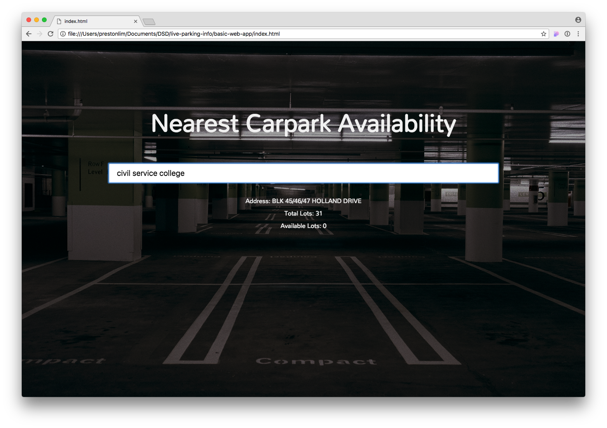

slidenumbers: true

# Hands On Coding Workshop

---

# Objectives

* Understand iterative product development
* Learn about web applications
  * Frontend (HTML, Javascript, CSS)
  * APIs
  * Backend/server

---

# Overview

* Sharing on parking.sg
* Hands on coding workshop

---

# Sharing on parking.sg

---

# Hands on coding workshop

---

# What you're going to build



---

# Hands on workshop

1. What is a website?
1. Displaying text
1. Adding interaction
1. Communicating with other apps
1. Adding styles!
1. A simple server

---

# Before we begin

* Slides are provided as handouts
* You can also refer to digital copy of the slides

---

# Step 1 - Displaying some text


---

# Setup

Open the folder using Atom.

Open the `index.html` file using Google Chrome.

---

```html
hello
```

* Save the file and refresh the page in Chrome
* Websites are just text files interpreted by the browser
* HTML files specify the content that the browser should display

---

```html
<body>
  hello
</body>
```

* HTML uses tags to differentiate between different parts of the page
* `<body>` - opening tag for the page's content
* `</body>` - closing tag
* Everything between opening and closing tags is the tag's content


^ html, body, opening and closing tags

---

```html
<body>
  hello there!
</body>
```

---

```html
<body>
  hello

  there!
</body>
```

* HTML has a specific way of formatting content
* What you see is not necessarily what you get

^ html does not care about your file. just a structure

---

```html, [.highlight: 2]
<body>
  <h1>hello</h1>

  there!
</body>
```

* The `h1` tag makes the content inside become a **header**

^ different tags, a bit of styles

---

```html
<body>
  <h1>Nearest Carpark Availability</h1>
</body>
```

---

```html, [.highlight: 3]
<body>
  <h1>Nearest Carpark Availability</h1>
  <input>
</body>
```

* `input` creates an input box
* `input` is a basic element, does not require a closing tag

---

```html, [.highlight: 3]
<body>
  <h1>Nearest Carpark Availability</h1>
  <input placeholder="Enter a location">
</body>
```

* HTML elements/tags can have extra **attributes** given to them
* These **attributes** can change the behaviour and appearance of the element

---

```html, [.highlight: 5]
<body>
  <h1>Nearest Carpark Availability</h1>
  <input placeholder="Enter a location">

  <div>Hello!</div>
</body>
```

`div`s are containers for content

---

```html
<body>
  <h1>Nearest Carpark Availability</h1>
  <input placeholder="Enter a location">

  <div>Address: Blk 123 Imaginary Road</div>
  <div>Total Lots: 456</div>
  <div>Available Lots: 78</div>
</body>
```

`div`s can be used to organise and arrange content

---

# A short detour

Adding styles to your page!

```html
<body style="background-color: lightskyblue">
  .
  .
  .
</body>
```

[https://developer.mozilla.org/en-US/docs/Web/CSS/color_value](https://developer.mozilla.org/en-US/docs/Web/CSS/color_value)

---

# Step 1 - A quick recap

* HTML files in browser are webpages
* HTML tells the browser what to display 
* HTML tags, attributes

---

# What's next:

## Adding interaction to our page!

---

# Metaphor - the human body

| Term         | Metaphor | Function            |
|--------------|----------|---------------------|
| HTML         | Skeleton | Structure           |
| CSS (styles) | Skin     | Styling, formatting |
| Javascript   | Brain    | Behaviour/actions   |

---

```html, [.highlight: 10]
<body>
  <h1>Nearest Carpark Availability</h1>
  <input placeholder="Enter a location">

  <div>Address: Blk 123 Imaginary Road</div>
  <div>Total Lots: 456</div>
  <div>Available Lots: 78</div>
</body>

<script> alert("Hello!") </script>
```

\-\-\-\-\-\-\-\-\-\-\-\-\-\-\-\-\-\-\-\-\-\-\-\-\-\-\-\-\-\-\-\-\-\-\-\-\-\-\-\-\-\-\-\-\-\-\-\-\-\-\-\-\-\-\-\-\-\-\-\-\-\-\-\-\-\-\-\-\-\-\-\-\-\-\-\-\-\-\-\-\-\-\-\-\-

`script` content is javascript code that the browser will execute

---

```html, [.highlight: 10]
<body>
  <h1>Nearest Carpark Availability</h1>
  <input placeholder="Enter a location">

  <div>Address: Blk 123 Imaginary Road</div>
  <div>Total Lots: 456</div>
  <div>Available Lots: 78</div>
</body>

<script src="carpark-logic.js"></script>
```

\-\-\-\-\-\-\-\-\-\-\-\-\-\-\-\-\-\-\-\-\-\-\-\-\-\-\-\-\-\-\-\-\-\-\-\-\-\-\-\-\-\-\-\-\-\-\-\-\-\-\-\-\-\-\-\-\-\-\-\-\-\-\-\-\-\-\-\-\-\-\-\-\-\-\-\-\-\-\-\-\-\-\-\-\-

To make it simpler, we can put the javascript code into another file

---

`carpark-logic.js`

```javascript
alert("Hello!")
```

\-\-\-\-\-\-\-\-\-\-\-\-\-\-\-\-\-\-\-\-\-\-\-\-\-\-\-\-\-\-\-\-\-\-\-\-\-\-\-\-\-\-\-\-\-\-\-\-\-\-\-\-\-\-\-\-\-\-\-\-\-\-\-\-\-\-\-\-\-\-\-\-\-\-\-\-\-\-\-\-\-\-\-\-\-

Note: For subsequent slides, the slide title is the file you should be editing


---

# What's next

We want to use javascript to insert text into our HTML document. We can do that by:

1. Finding the right location in our HTML where we want to inject text
1. Inject the text into that location!

---

# What's next

To find the right location to inject the text, we need to give the location a name (or ID)!

---

`index.html`

```html, [.highlight: 5]
<body>
  <h1>Nearest Carpark Availability</h1>
  <input placeholder="Enter a location">

  <div id="carparkAddress"></div>
  <div>Total Lots: 456</div>
  <div>Available Lots: 78</div>
</body>

<script src="carpark-logic.js"></script>
```

Refresh the page - the address should have disappeared

---

`carpark-logic.js`

```javascript
document.getElementById("carparkAddress").innerText =
  "Address: Blk 123 Imaginary Road"
```

\-\-\-\-\-\-\-\-\-\-\-\-\-\-\-\-\-\-\-\-\-\-\-\-\-\-\-\-\-\-\-\-\-\-\-\-\-\-\-\-\-\-\-\-\-\-\-\-\-\-\-\-\-\-\-\-\-\-\-\-\-\-\-\-\-\-\-\-\-\-\-\-\-\-\-\-\-\-\-\-\-\-\-\-\-

* `document.getElementById` allows the javascript to find the right element in the HTML
* Setting `innerText` changes the content of the HTML element
* Refresh the page and the address should reappear

---

`index.html`

```html, [.highlight: 5-7]
<body>
  <h1>Nearest Carpark Availability</h1>
  <input placeholder="Enter a location">

  <div id="carparkAddress"></div>
  <div id="carparkTotalLots"></div>
  <div id="carparkAvailableLots"></div>
</body>

<script src="carpark-logic.js"></script>
```

Refresh the page - total and available lots should have disappeared

---

`carpark-logic.js`

```javascript
document.getElementById("carparkAddress").innerText =
  "Address: Blk 123 Imaginary Road"
document.getElementById("carparkTotalLots").innerText =
  "Total Lots: 456"
document.getElementById("carparkAvailableLots").innerText =
  "Available Lots: 78"
```

Refresh the page - total and available lots should reappear

---

`carpark-logic.js`

```javascript
function addCarparkToPage(address, totalLots, availableLots) {
  document.getElementById("carparkAddress").innerText =
    "Address: " + address
  document.getElementById("carparkTotalLots").innerText =
    "Total Lots: " + totalLots
  document.getElementById("carparkAvailableLots").innerText =
    "Available Lots: " + availableLots
}
```

**Introducing functions**

Functions are like recipes - they're a way to group some instructions together


---

`carpark-logic.js`

```javascript, [.highlight: 1]
function addCarparkToPage(address, totalLots, availableLots) {
  document.getElementById("carparkAddress").innerText =
    "Address: " + address
  document.getElementById("carparkTotalLots").innerText =
    "Total Lots: " + totalLots
  document.getElementById("carparkAvailableLots").innerText =
    "Available Lots: " + availableLots
}
```

`addCarparkToPage` is the function name

`address, totalLots, availableLots` are function **inputs**

---

`carpark-logic.js`

```javascript
function addCarparkToPage(address, totalLots, availableLots) {
  document.getElementById("carparkAddress").innerText =
    "Address: " + address
  document.getElementById("carparkTotalLots").innerText =
    "Total Lots: " + totalLots
  document.getElementById("carparkAvailableLots").innerText =
    "Available Lots: " + availableLots
}

addCarparkToPage("Blk 123", "456", "78") // run the function
```

Defining VS running the function
Writing VS cooking the recipe

Refresh the page - the text should reappear

---

# Recap

* Javascript adds interaction
* Javascript links to HTML using `getElementById`
* A function is a bunch of code that's grouped together
* Calling a function runs the code in it

---

# What's next?

Handle the input that has been typed in

---

`index.html`

```html, [.highlight: 3]
<body>
  <h1>Nearest Carpark Availability</h1>
  <input id="locationInput" placeholder="Enter a location">

  <div id="carparkAddress"></div>
  <div id="carparkTotalLots"></div>
  <div id="carparkAvailableLots"></div>
</body>

<script src="carpark-logic.js"></script>
```

Give the input element an ID

---

`carpark-logic.js`

```javascript, [.highlight: 9]
function addCarparkToPage(address, totalLots, availableLots) {
  .
  .
  .
}

addCarparkToPage("Blk 123", "456", "78")

document.getElementById("locationInput")
```

Retrieve the input element using its ID

---

`carpark-logic.js`

```javascript, [.highlight: 9]
function addCarparkToPage(address, totalLots, availableLots) {
  .
  .
  .
}

addCarparkToPage("Blk 123", "456", "78")

var locationInput = document.getElementById("locationInput")
```

`var` is short for variable

Saving the element into the `locationInput` variable

Like saving your word document into Document.docx

---

`carpark-logic.js`

```javascript, [.highlight: 3]
var locationInput = document.getElementById("locationInput")

locationInput.addEventListener("keydown", handleKeydown)
```


* React to user typing in the input box by adding an **event listener** (`addEventListener`)
* `handleKeydown` is a function that will be called when the user types something (`keydown`)

---

`carpark-logic.js`

```javascript, [.highlight: 1-7]
var locationInput = document.getElementById("locationInput")

function handleKeydown(event) {
  addCarparkToPage("Blk 123", "456", "78")
}

locationInput.addEventListener("keydown", handleKeydown)
```

Remember to remove `addCarparkToPage` from earlier

Refresh the page - the text should disappear

Type into the input box - the text should reappear

---

`carpark-logic.js`

```javascript, [.highlight: 2-4]
function handleKeydown(event) {
  if (event.key === "Enter") {
    addCarparkToPage("Blk 123", "456", "78")
  }
}
```

We only want to care about when the `Enter` key is pressed

---

# What's next

Now we need to get the location that we typed in.

We can do that in a similar way to how we injected the text.

Find the input element, and extract it's content.

---

`carpark-logic.js`

```javascript, [.highlight: 3-4]
function handleKeydown(event) {
  if (event.key === "Enter") {
    var location = locationInput.value
    addCarparkToPage(location, "456", "78")
  }
}
```

`locationInput.value` gets the text that has been typed into the input box

---

# Recap

* React to user input by registering **event listeners**
* Only react to Enter key press
* Get the text that the user has typed in

---

# What's next?

Now we need to use the location to find the nearest carpark.

1) location -> X and Y 

2) X and Y -> Carpark

To get X and Y, we need to make an API call.

---

# What is an API call?

* Way for apps to communicate (over the internet)
* An API call is like a phone call to a wise person who has the answers to your questions
  * **"What time is it now?"**
  * **"Where are all the carparks in Singapore?"**
  * **"What is the current price of Bitcoin?"**

---

# Why use API calls?

* Don't reinvent the wheel
* Keeps our app simple!
* Some information can only be provided by certain people/organisations (e.g. price of Bitcoin)

---

# Our API call

"What are the X and Y coordinates of this location?"

[https://docs.onemap.sg/#onemap-rest-apis](https://docs.onemap.sg/#onemap-rest-apis)

---

`index.html`

```html, [.highlight: 1-3]
<head>
  <script src="https://unpkg.com/axios/dist/axios.min.js"></script>
</head>

<body>
  ...
</body>

<script src="carpark-logic.js"></script>
```

* We need the help of a library (`axios`) to make this call
* `head` loads our library before the `body`

^ How would one know which library to use?

---

`carpark-logic.js`

```javascript, [.highlight: 1-13, 18]

function searchXY(coordinates) {
  // X and Y -> Carpark
  addCarparkToPage("nearest carpark to XY", "456", "78")
}

function searchLocation(location) {
  // location -> X and Y
  var coordinates = { 
    X: 123,
    Y: 456
  }
  searchXY(coordinates)
}

function handleKeydown(event) {
  if (event.key === "Enter") {
    var location = locationInput.value
    searchLocation(location)
  }
}

```

Create the `searchLocation` and `searchXY` function
Plan our logic

^ Test that carpark is visible on front end

---

`carpark-logic.js`

```javascript, [.highlight: 3-9, 15]

function searchLocation(location) {
  // location -> X and Y
  axios.get("https://developers.onemap.sg/commonapi/search", {
    params: {
      searchVal: location,
      returnGeom: "Y",
      getAddrDetails: "N"
    }
  }).then(response => {
    var coordinates = { 
      X: 123,
      Y: 456
    }
    searchXY(coordinates)
  })
}

```
Make the API call

---

`carpark-logic.js`

```javascript, [.highlight: 10]

function searchLocation(location) {
  // location -> X and Y
  axios.get("https://developers.onemap.sg/commonapi/search", {
    params: {
      searchVal: location,
      returnGeom: "Y",
      getAddrDetails: "N"
    }
  }).then(response => {
    console.log(response)
    var coordinates = { 
      X: 123,
      Y: 456
    }
    searchXY(coordinates)
  })
}

```
`console.log` the API response

^ Show response object from API in browser

---

`carpark-logic.js`

```javascript, [.highlight: 11]
function searchLocation(location) {
  // location -> X and Y
  axios.get("https://developers.onemap.sg/commonapi/search", {
    params: {
      searchVal: location,
      returnGeom: "Y",
      getAddrDetails: "N"
    }
  }).then(response => {
    console.log(response)
    var coordinates = response.data.results[0]
    searchXY(coordinates)
  })
}
```

Extract the coordinates from the `response`

---

`carpark-logic.js`

```javascript, [.highlight: 11]
function searchLocation(location) {
  // location -> X and Y
  axios.get("https://developers.onemap.sg/commonapi/search", {
    params: {
      searchVal: location,
      returnGeom: "Y",
      getAddrDetails: "N"
    }
  }).then(response => {
    var coordinates = response.data.results[0]
    console.log(coordinates)
    searchXY(coordinates)
  })
}
```

`console.log` the X and Y coordinates for us to check that it is correct

---

# What's next

* Now we want to get the nearest carpark to that X and Y value
* Slightly too complicated for now, so we can use a helper API that I created

---

`index.html`

```html, [.highlight: 9]
<head>
  <script src="https://unpkg.com/axios/dist/axios.min.js"></script>
</head>

<body>
  ...
</body>

<script src="carpark-helpers.js"></script>
<script src="carpark-logic.js"></script>
```

Import my helper API

---

`carpark-logic.js`

```javascript, [.highlight: 3-5]
function searchXY(coordinates) {
  // X and Y -> Carpark
  getNearestCarparkTo(coordinates.X, coordinates.Y).then(carpark => {
    addCarparkToPage(carpark.address, carpark.total_lots, carpark.lots_available)
  })
}
```

Use my helper API

---

# Recap

* Made API call to convert location to X and Y
* Use helper API to get the nearest carpark

---

# What's next?

* Content and logic is all done!
* Next - styling your site!

---

`index.html`

```html, [.highlight: 3]
<head>
  <script src="https://unpkg.com/axios/dist/axios.min.js"></script>
  <link rel="stylesheet" type="text/css" href="carpark-style.css"></link>
</head>

<body>
  <h1>Nearest Carpark Availability</h1>
  <input id="locationInput" placeholder="Enter a location">

  <div id="carparkAddress"></div>
  <div id="carparkTotalLots"></div>
  <div id="carparkAvailableLots"></div>
</body>

<script src="carpark-helpers.js"></script>
<script src="carpark-logic.js"></script>
```

---

`carpark-style.css`

```css, [.highlight: 3, 5, 7, 9, 11, 13]
@import url('https://fonts.googleapis.com/css?family=Mandali');

body {
  /* ... */
}

h1 {
  /* ... */
}

input {
  /* ... */
}
```

`body`, `h1`, `input` are CSS Selectors

---

`index.html`

```html, [.highlight: 6, 7, 8]
<head>
  <script src="https://unpkg.com/axios/dist/axios.min.js"></script>
  <link rel="stylesheet" type="text/css" href="carpark-style.css"></link>
</head>

<body>
  <h1>Nearest Carpark Availability</h1>
  <input id="locationInput" placeholder="Enter a location">

  <div id="carparkAddress"></div>
  <div id="carparkTotalLots"></div>
  <div id="carparkAvailableLots"></div>
</body>

<script src="carpark-helpers.js"></script>
<script src="carpark-logic.js"></script>
```

---

`carpark-style.css`

```css, [.highlight: 1]
@import url('https://fonts.googleapis.com/css?family=Mandali');

...

```

Import a font package from fonts.google.com

---

`carpark-style.css`

```css, [.highlight: 3-7, 13]
@import url('https://fonts.googleapis.com/css?family=Mandali');

body {
  background-image: url("background-image.png");
  background-position: center;
  background-repeat: no-repeat;
  background-size: cover;

  font-family: "Mandali";
  text-align: center;
  color: #F2F2F2;
  margin-top: 10%;
}

...

```

Style the `body` - add background image

---

`carpark-style.css`

```css, [.highlight: 9-12]
@import url('https://fonts.googleapis.com/css?family=Mandali');

body {
  background-image: url("background-image.png");
  background-position: center;
  background-repeat: no-repeat;
  background-size: cover;

  font-family: "Mandali";
  text-align: center;
  color: #F2F2F2;
  margin-top: 10%;
}

...

```

Style the `body` - font and margin

---

`carpark-style.css`

```css, [.highlight: 7-9]
@import url('https://fonts.googleapis.com/css?family=Mandali');

body {
  /* ... */
}

h1 {
  font-size: 64px;
}

```

Style the `h1`

---


`carpark-style.css`

```css, [.highlight: 5-12]
h1 {
  /* ... */
}

input {
  font-size: 20px;

  width: 70%;
  padding: 12px 20px;
  margin-bottom: 30px;
  border-radius: 4px;
}
```

Style the `input` (search box)

---

`carpark-style.css`

```css, [.highlight: 5-12]
input {
  /* ... */
}

@media only screen  
  and (max-device-width: 480px) {

  input {
    font-size: 32px;
    width: 95%;
  }
}
```

`@media` query: checking for screen size and then defining a specific style for the element

---

# Recap

* Use CSS Selectors to style the `body`, `h1`, and `input`
* Use `@media` queries to set style for mobile devices

---

# Recap

| Term         | Metaphor | Function            |
|--------------|----------|---------------------|
| HTML         | Skeleton | Structure           |
| CSS (styles) | Skin     | Styling, formatting |
| Javascript   | Brain    | Behaviour/actions   |

---

# Next Step!

* Deploying your app to the internet
* Up to now, your website is just on your computer
* We will now deploy it to the internet so everyone can see and use it!

---

# Deployment

1. Go to [https://www.bitballoon.com/](https://www.bitballoon.com/)
1. Drag and drop the app folder on to the site.
1. Wait for it to process your data
1. Voila! Your site has been hosted!

---

# Recap

1. What a website consists of
1. HTML + Javascript + CSS
1. API calls - communication over the internet
1. Deploying websites

---

# Next Step - Building your own API

* Build a simple backend to serve a simple API
* We'll replace my helper API with a real API

---

Create a new file called `backend.js`

`backend.js`

```javascript
var express = require("express")

var app = express()

app.listen(3000, function () {
  console.log("Server running...")
})
```

* Open the command line (TAs can help!)
* Type `node backend.js` and hit enter
* You should see `Server running...`

---

`backend.js`

```javascript, [.highlight: 1]
var express = require("express")

var app = express()

app.listen(3000, function () {
  console.log("Server running...")
})
```

* Importing `express`, a lightweight server

---

`backend.js`

```javascript, [.highlight: 3]
var express = require("express")

var app = express()

app.listen(3000, function () {
  console.log("Server running...")
})
```

* Creating our server

---

`backend.js`

```javascript, [.highlight: 5]
var express = require("express")

var app = express()

app.listen(3000, function () {
  console.log("Server running...")
})
```

* Running our server - start listening to requests

---

Right now your server is listening, but doesn't respond to any requests.

You've set up a phone, but you're not answering any calls.

**Next step: make your server respond to incoming requests.**

---

`backend.js`

```javascript, [.highlight: 5-7]
var express = require("express")

var app = express()

app.get("/", function (req, res) {
  res.send("Hello")
})

app.listen(3000, function () {
  console.log("Server running...")
})
```

* Listen to "`/`"
* When "`/`" is requested, send `Hello` as the response

^ i.e. my phone number is 98765432
^ i.e. when someone calls me at 98765432, say Hello

---

`backend.js`

```javascript, [.highlight: 2, 7-10]
var express = require("express")
var getNearestCarparkTo = require("./carpark-helpers.js")

var app = express()

app.get("/", function (req, res) {
  getNearestCarparkTo(req.query.x, req.query.y).then(carpark => {
    res.set("Access-Control-Allow-Origin", "*")
    res.send(carpark)
  })
})
```

* Send the `x` and `y` values to the helper API
* Helper API responds with the nearest carpark
* Take the carpark and send it back to the requester

---

`backend.js`

```javascript
var express = require("express")
var getNearestCarparkTo = require("./carpark-helpers.js")

var app = express()

app.get("/", function (req, res) {
  getNearestCarparkTo(req.query.x, req.query.y).then(carpark => {
    res.set("Access-Control-Allow-Origin", "*")
    res.send(carpark)
  })
})

app.listen(3000, function () {
  console.log("Server running...")
})
```

---

`index.html`

```html, [.highlight: 15]
<head>
  <script src="https://unpkg.com/axios/dist/axios.min.js"></script>
  <link rel="stylesheet" type="text/css" href="carpark-style.css"></link>
</head>

<body>
  <h1>Nearest Carpark Availability</h1>
  <input id="locationInput" placeholder="Enter a location">

  <div id="carparkAddress"></div>
  <div id="carparkTotalLots"></div>
  <div id="carparkAvailableLots"></div>
</body>

<script src="carpark-helpers.js"></script>
<script src="carpark-logic.js"></script>
```

Delete the highlighted line

---

`index.html`

```html
<head>
  <script src="https://unpkg.com/axios/dist/axios.min.js"></script>
  <link rel="stylesheet" type="text/css" href="carpark-style.css"></link>
</head>

<body>
  <h1>Nearest Carpark Availability</h1>
  <input id="locationInput" placeholder="Enter a location">

  <div id="carparkAddress"></div>
  <div id="carparkTotalLots"></div>
  <div id="carparkAvailableLots"></div>
</body>

<script src="carpark-logic.js"></script>
```

Refresh the page - the search should no longer be working

---

`carpark-logic.js`

```javascript, [.highlight: 2-4]
function searchXY(coordinates) {
  getNearestCarparkTo(coordinates.X, coordinates.Y).then(carpark => {
    addCarparkToPage(carpark.address, carpark.total_lots, carpark.lots_available)
  })
}
```

Delete the highlighted lines

---

`carpark-logic.js`

```javascript, [.highlight: 2-11]
function searchXY(coordinates) {
  var url = "http://localhost:3000"
  axios.get(url, {
    params: {
      x: coordinates.X,
      y: coordinates.Y
    }
  }).then(carpark => {
    var carpark = response.data
    addCarparkToPage(carpark.address, carpark.total_lots, carpark.lots_available)
  })
}
```

Set up `carpark-logic` to use our backend API

---

# That's all folks!

## Any questions?